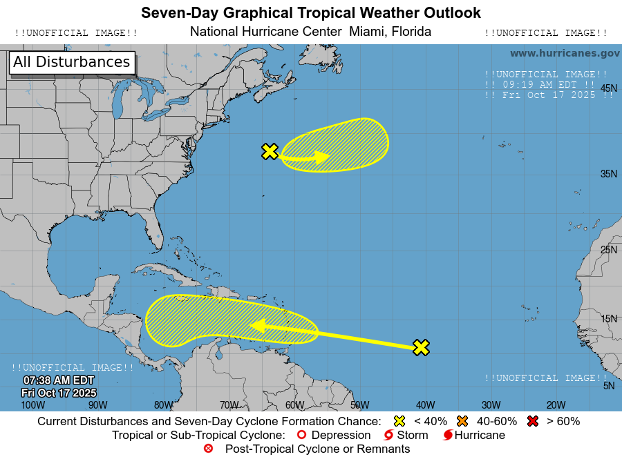

# NHC Cones
##### Author: Protuhj
##### Version: 0.9.4

#### Disclaimer:  
I am in no way associated with the National Hurricane Center, and this project or its output is not intended for official use.  


---

#### Description:
Takes the current storm data from the National Hurricane Center (NHC) and plots all of the forecast cones onto the 5 day forecast graphics


Example output for the Atlantic forecast:  



---

#### Dependencies

Written against Python 3.6

From requirements.txt:  
```
certifi==2020.6.20
chardet==3.0.4
idna==2.10
lxml==4.5.2
Pillow==7.2.0
pytz==2020.1
requests==2.24.0
urllib3==1.25.10
```

#### Running it  

- Set up a Python virtual environment :   

`python3.6 -m venv env`  

- Activate the virtual environment:  

`source ./env/bin/activate`  

- Install requirements:  

`pip3.6 install -r requirements.txt`  

- Run it:  

python3.6 main.py


