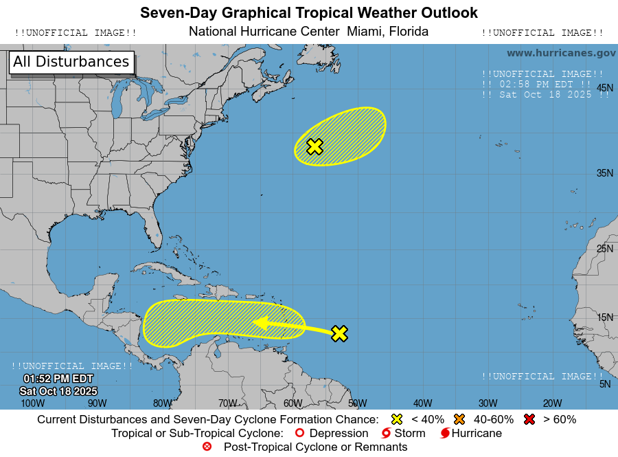
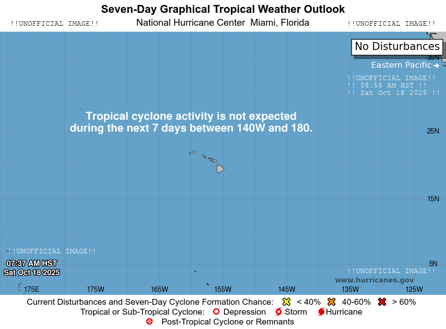

### Atlantic Basin

### Eastern Pacific

### Central Pacific

---

[Definition of the NHC Track Forecast Cone](https://www.nhc.noaa.gov/aboutcone.shtml)

---

##### Disclaimer:

This imagery is not intended for official use, but is provided for entertainment purposes only. There will be bugs, I promise you!

For official guidance, please visit the National Hurricane Center's [website](https://www.nhc.noaa.gov/).

###### Supporting

If you'd like to send a tip to pay for server time, you can send it via PayPal with my e-mail: *protuhj at gmail.com*
